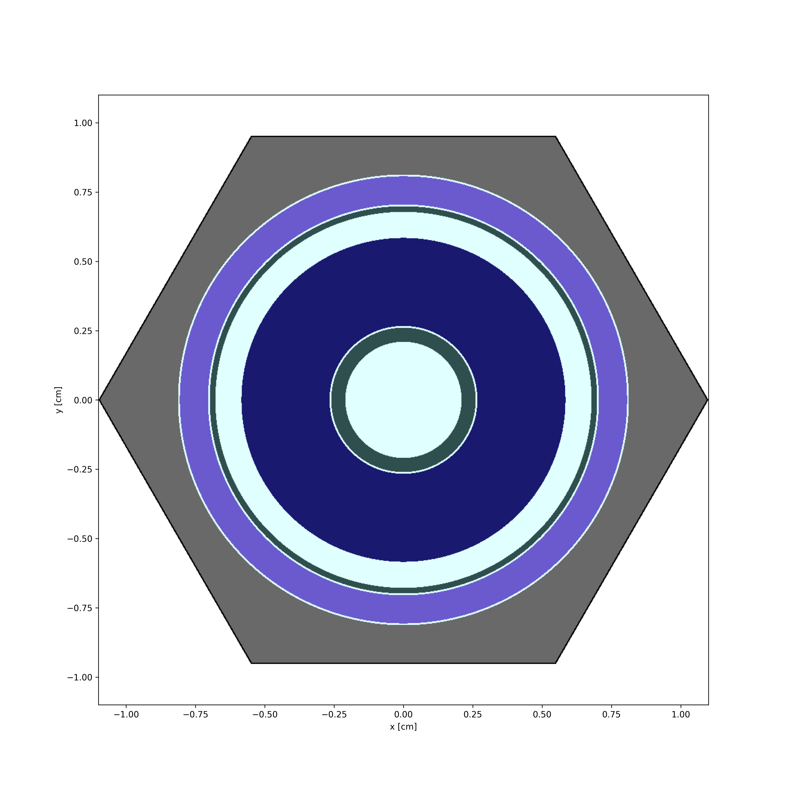

# UROP Repository: A Multiphysics Simulation Analysis of Nuclear Propulsion Space Rockets using Machine Learning

> Author: Jimmy van de Worp

> Supervisor: Dr Matthew Eaton

## Contents

 - Introduction
 - Project Brief
 - Repository and Code Structure
 - Prerequisites
 - Results
 - Acknowledgements
 - About Author

## Introduction

This repository hosts the code for the Undergraduate Research Oppurtunities Programme (UROP) project titled "A Multiphysics Simulation Analysis of Nuclear Propulsion Space Rockets using Machine Learning." Supervised by Dr. Matthew Eaton from Imperial College London, the project is a collaborative effort with the Rolls-Royce University Technology Centre (UTC) in Nuclear Engineering, also based at Imperial College London. Generously funded by the Engineering & Physical Sciences Research Council's (EPSRC) Vacation Bursary UROP Award.

## Project Brief

Future crewed deep space missions will almost certainly require propulsion systems levels that exceed those of the most efficient chemical rockets. One possible space propulsion system which is being investigated by NASA, and companies such as Rolls-Royce and BWXT, is space nuclear thermal rocket propulsion (SNTRP). The efficiency of a space propulsion system is characterised by the specific impulse (the time required for 1 kg of propellant to produce 1 Newton of thrust). Compared to chemical rockets, SNTRP has a very high specific impulse and thus a comparatively high efficiency due to the very high temperatures achieved. The use of high specific impulse propulsion technologies means deep space missions can be of shorter duration and thus reduce the radiation dose astronauts receive from background cosmic radiation. SNTRP technology uses nuclear energy to heat a propellant, usually hydrogen, which then expands and is then expelled out of a nozzle to produce thrust. However, one of the key challenges of SNTRP is the safety and performance of the nuclear fuel during long deep space missions. The high temperatures achieved (greater than 3000 Kelvin) can affect the nuclear fuel integrity and lead to fuel failure which can be catastrophic for deep space missions. Therefore, the aim of this UROP project will be to develop mechanistic, coupled, multiphysics, CFD and thermal stress models of SNRTP systems. The SNTRP system which will be analysed is the small nuclear rocket engine (SNRE) which was the last engine design studied by Los Alamos National Laboratory (LANL) during their Nuclear Engine for Rocket Vehicle Application (NERVA) programme which ran from 1955-1973. By analysing the results of these multiphysics simulations, it will then be possible to understand how nuclear fuel assemblies will behave during start-up and shutdown of space nuclear thermal rockets during long duration deep space missions. 

More specifically this UROP programme will focus on the following research tasks:
* Development of a spatially dependent neutronics model of the SNRE nuclear fuel assemblies using the SERPENT Monte Carlo code. This will compute the nuclear heat sources that are required for the CFD and finite element (FE) thermal stress models.
* Development of CFD and conjugate heat transfer models of the SNRE nuclear fuel assemblies using the Star-CCM+ CFD code.
* Development of thermal stress models of the SNRE nuclear fuel assemblies using the ABAQUS finite element (FE) thermal stress code.
* Coupling of the CFD and thermal stress models using the Siemens SIMULIA code coupling framework to understand the thermal stress within the nuclear fuel assemblies during start-up and shutdown of SNRE.
* Use of the GPU enabled neural network machine learning algorithms (encoded open-source software) to produce surrogate models of the multiphysics simulations. This will enable computationally efficiency parametric studies to be performed as well as uncertainty quantification (UQ).

## Repository and Code Structure
> File structure is not fully comphrehensive, only the most important folders and scripts are shown

    .
    ├── dataLibrary/                              
    │   ├── cross_sections.xml                     # Source Code for OpenMC Data Library in .xml format
    │   ├── cross_sections.xsdir                   # Source Code for Serpent Data Library in .xsdir format
    │   └── dataLibrary.py                         # Source Code for Library Conversion from Serpent Data Library to OpenMC Data Library
    ├── LaTeX_Files/                                
    │   ├── ICL_RR_MoD_Meeting_Script/             # Contains Custom Source Files for the LaTeX Script on the ICL-RR-MoD Meeting
    │   └── SNRE_Configuration/                    # Contains Custom Source Files for the LaTeX Script on the SNRE Configuration
    ├── SNREModelling_OpenMC/   
    │   ├── SNRE_2DFuelAssemblyModelling/          
    |   │   ├── dataFiles/                         # Contains Custom Data Files for the SNRE Fuel Assembly in 2D
    |   │   ├── pics/                              # Contains Custom Image Files for the SNRE Fuel Assembly in 2D
    |   │   ├── xmlFiles/                          # Contains Custom Source Files for the SNRE Fuel Assembly in 2D
    |   │   └── SNRE_2DFuelAssemblyModelling.ipynb # Source Code for OpenMC Model of the SNRE Fuel Assembly in 2D
    │   ├── SNRE_2DFuelPinModelling/               
    |   │   ├── dataFiles/                         # Contains Custom Data Files for the SNRE Fuel Pin in 2D
    |   │   ├── pics/                              # Contains Custom Image Files for the SNRE Fuel Pin in 2D
    |   │   ├── xmlFiles/                          # Contains Custom Source Files for the SNRE Fuel Pin in 2D
    |   │   └── SNRE_2DFuelPinModelling.ipynb      # Source Code for OpenMC Model of the SNRE Fuel Pin in 2D
    │   └── SNRE_3DFuelPinModelling/               
    |   │   ├── dataFiles/                         # Contains Custom Data Files for the SNRE Fuel Pin in 3D
    |   │   ├── pics/                              # Contains Custom Image Files for the SNRE Fuel Pin in 3D
    |   │   ├── xmlFiles/                          # Contains Custom Source Files for the SNRE Fuel Pin in 3D
    |   │   └── SNRE_3DFuelPinModelling.ipynb      # Source Code for OpenMC Model of the SNRE Fuel Pin in 3D    
    ├── SNREModelling_Serpent/   
    │   ├── SNRE_2DFuelAssemblyModelling/          
    |   │   ├── SNRE_2DAssemblyPinModelling            # Source Code for Serpent Model of the SNRE Fuel Assembly in 2D  
    |   │   └── SNRE_2DAssemblyPinModelling_res.m      # Custom Data Files for the SNRE Fuel Assembly in 2D 
    │   ├── SNRE_2DFuelPinModelling/               
    |   │   ├── SNRE_2DFuelPinModelling            # Source Code for Serpent Model of the SNRE Fuel Pin in 2D  
    |   │   └── SNRE_2DFuelPinModelling_res.m      # Custom Data Files for the SNRE Fuel Pin in 2D 
    ├── .gitignore
    └── README.md

## Prerequisites

The following packages and/or software codes are required to run the code in this repository:

* [OpenMC](https://docs.openmc.org/en/stable/#) - OpenMC is a community-developed Monte Carlo neutron and photon transport simulation code.
* [Serpent](https://serpent.vtt.fi/serpent/) - Serpent is a multi-purpose three-dimensional continuous-energy Monte Carlo particle transport code.
* [Matlab](https://uk.mathworks.com/products/matlab.html) - MATLAB is a programming and numeric computing platform used by millions of engineers and scientists to analyse data, develop algorithms, and create models.
* [Python](https://www.python.org/) - Python is an interpreted, high-level and general-purpose programming language.
* [Jupyter Notebook](https://jupyter.org/) - Jupyter Notebook is an open-source web application that allows you to create and share documents that contain live code, equations, visualizations and narrative text.
* [LaTeX](https://www.latex-project.org/) - LaTeX is a high-quality typesetting system; it includes features designed for the production of technical and scientific documentation.
* [Siemens Simulia](https://www.3ds.com/products-services/simulia/) - Siemens Simulia is a finite element analysis (FEA) software suite developed by Dassault Systèmes Simulia Corp.
* [Star-CCM+](https://www.cd-adapco.com/products/star-ccm) - Star-CCM+ is a multi-physics computational fluid dynamics (CFD) software tool.
* [ABAQUS](https://www.3ds.com/products-services/simulia/products/abaqus/) - ABAQUS is a finite element analysis (FEA) software suite developed by Dassault Systèmes Simulia Corp.

Additionally, the following Python packages are required to run the code in this repository:

* [Numpy](https://numpy.org/) - NumPy is the fundamental package for scientific computing with Python.
* [Pandas](https://pandas.pydata.org/) - Pandas is a fast, powerful, flexible and easy to use open source data analysis and manipulation tool.
* [Scipy](https://www.scipy.org/) - SciPy is a Python-based ecosystem of open-source software for mathematics, science, and engineering.
* [Math](https://docs.python.org/3/library/math.html) - This module provides access to the mathematical functions defined by the C standard.
* [Matplotlib](https://matplotlib.org/) - Matplotlib is a comprehensive library for creating static, animated, and interactive visualizations in Python.
* [OpenMC Python API](https://docs.openmc.org/en/stable/pythonapi/index.html) - OpenMC is a community-developed Monte Carlo neutron and photon transport simulation code.

## Results

The results of the OpenMC and Serpent models are presented in the following figures:

### SNRE Fuel Pin

The following figures show the geometry of the SNRE Fuel Pin in 2D:

#### SNRE Fuel Element

#### SNRE Support Element

### SNRE Fuel Assembly

The following figures show the geometry of the SNRE Fuel Assembly in 2D:

## Acknowledgements

* [Dr. Matthew Eaton](https://www.imperial.ac.uk/people/m.eaton) - Imperial College London
* [Serpent](http://montecarlo.vtt.fi/download/Serpent_manual.pdf) - Serpent Documentation
* [OpenMC](https://docs.openmc.org/en/stable/usersguide/index.html) - OpenMC Documentation

## About Author

Currently a Final Year Undergraduate MEng student at Imperial College London, Department of Mechanical Engineering.

Contact Details:

* [LinkedIn](https://www.linkedin.com/in/jimmy-van-de-worp-498900189/) - Jimmy van de Worp
* [GitHub](https://github.com/jimmyvdw) - jimmyvdw
* [Email](mailto:jv20@ic.ac.uk) - jv20@ic.ac.uk